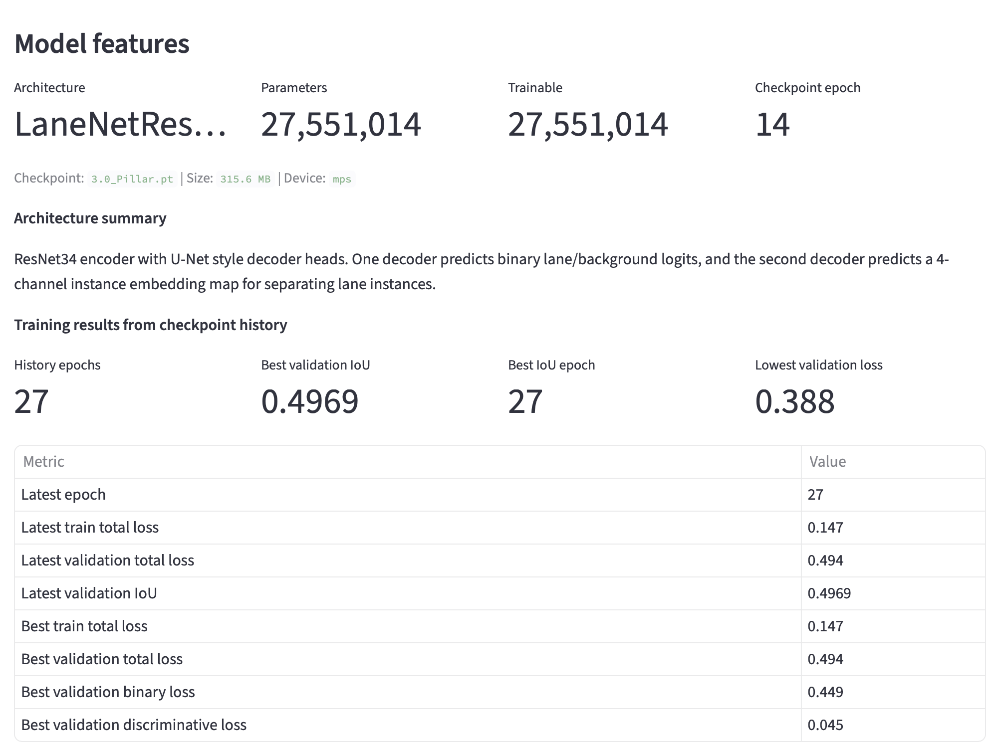
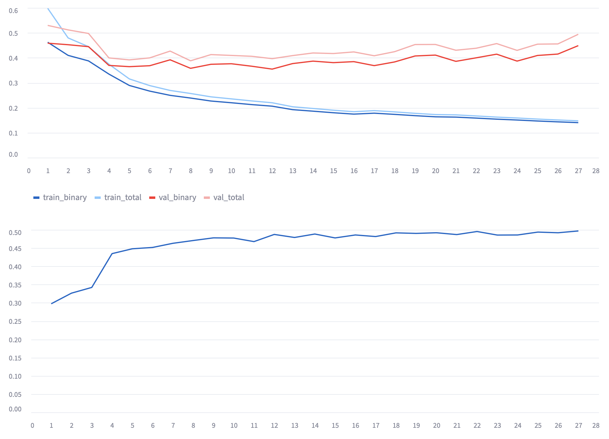

# Deep Learning Lane Detection

This project focuses on lane detection using a deep learning approach inspired
by LaneNet. The goal is to detect lane markings in road images and videos by
combining semantic segmentation with instance-level lane separation.

Instead of only predicting whether a pixel belongs to a lane, the model also
learns an embedding for each lane pixel. These embeddings are later clustered
to separate individual lane lines.

## Project Goal

Lane detection is an important perception task for driver assistance and
autonomous driving systems. The model in this project is trained to:

- classify each pixel as lane or background,
- learn instance embeddings for lane pixels,
- separate different lane markings from each other,
- fit smooth lane curves after postprocessing.

The deep learning pipeline is the main part of this project. It is designed to
be more flexible than fixed-rule image processing because the model learns lane
features directly from data.

## Model 3.0 Pillar Results

The best working model in the final project demo is `3.0_Pillar.pt`. Although
validation metrics are useful for comparison, this model was selected because it
gave the most reliable visual lane detection behavior in the complete inference
pipeline.

### Example Output Video

<video src="ExampleOutput.mov" controls width="800"></video>

If the video does not render in your Markdown viewer, open it directly:

[Example output video](ExampleOutput.mov)

### Model Features



### Training Graphs



## Model Architecture

The main model is implemented in:

```text
DeepLearningTechnique/src/models/lanenet.py
```

The strongest model variant is:

```python
LaneNetResNet34
```

It has three main parts:

1. A ResNet34 encoder
2. A binary segmentation decoder
3. An instance embedding decoder

## ResNet34 Encoder

The encoder is implemented in:

```text
DeepLearningTechnique/src/models/ResNetEncoder.py
```

The model uses the convolutional part of ResNet34 and removes the classification
head. This is because lane detection needs dense pixel-level predictions rather
than one image-level class label.

The encoder outputs feature maps at multiple scales:

```text
s4, s8, s16, s32
```

These correspond to feature maps at different downsampling levels:

- `s4`: 1/4 input resolution
- `s8`: 1/8 input resolution
- `s16`: 1/16 input resolution
- `s32`: 1/32 input resolution

These feature maps are used as skip connections in the decoder.

## U-Net Style Decoders

The model has two decoder branches:

```python
self.binary_decoder
self.embedding_decoder
```

Both decoders use a U-Net-like structure. They start from the deepest encoder
feature map and progressively upsample back to the original input resolution.
Skip connections from the encoder help recover spatial detail, which is
important for thin lane markings.

The binary decoder outputs:

```text
(B, 2, H, W)
```

The two channels represent:

- background
- lane

The embedding decoder outputs:

```text
(B, embedding_dim, H, W)
```

In this project, the embedding dimension is usually `4`.

The model forward pass returns:

```python
binary_logits, embedding = model(x)
```

## Input Size

The configured input resolution is:

```python
IMAGE_WIDTH = 768
IMAGE_HEIGHT = 384
```

These dimensions keep a 2:1 aspect ratio and are divisible by 32, which fits the
ResNet34 encoder downsampling structure.

## Dataset Format

The dataset loader is implemented in:

```text
DeepLearningTechnique/src/data/dataset.py
```

The dataset uses manifest files such as `train.txt` and `val.txt`. Each line in
the manifest contains:

```text
image_path binary_mask_path instance_mask_path
```

Example:

```text
train_set/clips/0313-1/11100/20.jpg train_set/seg_label/clips/0313-1/11100/20.png train_set/instance_label/clips/0313-1/11100/20.png
```

Each training sample contains:

- the RGB road image,
- a binary mask for lane vs background,
- an instance mask where each lane has a different ID.

The binary mask is used for segmentation loss. The instance mask is used for the
embedding loss.

## Data Preprocessing

Preprocessing and augmentation are implemented in:

```text
DeepLearningTechnique/src/data/transforms.py
```

Each image and mask is resized to:

```text
768 x 384
```

Images are converted from BGR to RGB and normalized with ImageNet statistics:

```python
mean = [0.485, 0.456, 0.406]
std  = [0.229, 0.224, 0.225]
```

Masks are resized using nearest-neighbor interpolation so that label values are
not corrupted.

During training, the project applies augmentations such as:

- color jitter,
- random blur,
- horizontal flip,
- translation,
- perspective transformation.

These augmentations help the model generalize to different lighting,
viewpoints, and road appearances.

## Loss Function

The loss functions are implemented in:

```text
DeepLearningTechnique/src/loss.py
```

The total loss combines:

1. binary segmentation loss,
2. discriminative embedding loss.

```python
total_loss = binary_loss + discriminative_loss
```

## Binary Segmentation Loss

The binary segmentation loss combines cross entropy and Dice loss.

Cross entropy helps classify each pixel as lane or background. Dice loss helps
optimize overlap between predicted lane pixels and ground truth lane pixels,
which is useful because lane markings are thin and occupy a small part of the
image.

The project also uses class weights because most pixels are background:

```python
CLASS_WEIGHTS = torch.tensor([1.4540, 20.1856])
```

The lane class receives a much larger weight so the model does not learn to
ignore lane pixels.

## Discriminative Embedding Loss

The embedding branch is trained with a discriminative loss. This loss encourages
pixels from the same lane to have similar embeddings and pixels from different
lanes to have different embeddings.

It has three parts:

- a variance term that pulls same-lane pixels together,
- a distance term that pushes different lane clusters apart,
- a regularization term that keeps cluster centers bounded.

This allows the model to detect a variable number of lane instances instead of
being limited to a fixed number of output lanes.

## Training

Training is mainly done in the notebooks:

```text
DeepLearningTechnique/train.ipynb
DeepLearningTechnique/trainCULane.ipynb
```

The training process is:

1. Load the dataset manifest.
2. Create `LaneDataset` objects.
3. Use PyTorch `DataLoader` for batching.
4. Run the model forward pass.
5. Compute binary segmentation loss.
6. Compute discriminative embedding loss.
7. Backpropagate the total loss.
8. Update model weights.
9. Evaluate on validation data.
10. Save checkpoints.

Important configuration values are:

```python
BATCH_SIZE = 8
LEARNING_RATE = 5e-4
EPOCHS = 150
```

Checkpoint utilities are implemented in:

```text
DeepLearningTechnique/src/utils.py
```

## Postprocessing

The model outputs dense tensors, not final lane curves. Postprocessing converts
the network outputs into lane lines.

Postprocessing is implemented in:

```text
DeepLearningTechnique/src/postprocess.py
```

The process is:

1. Convert binary logits into lane probabilities.
2. Threshold lane probabilities to create a lane mask.
3. Remove small connected components.
4. Collect lane pixels.
5. Combine embedding features with pixel coordinates.
6. Cluster lane pixels using DBSCAN.
7. Fit a polynomial curve to each lane cluster.

Lane curves are fitted as:

```text
x = f(y)
```

This works better for lane lines because they are usually close to vertical in
image coordinates.

## Summary

The deep learning system uses a LaneNet-style architecture with a ResNet34
encoder and two decoder heads. One head performs binary lane segmentation, while
the other learns instance embeddings. The model is trained with a combination of
segmentation loss and discriminative embedding loss. After inference, DBSCAN and
polynomial fitting are used to convert dense predictions into individual lane
curves.
